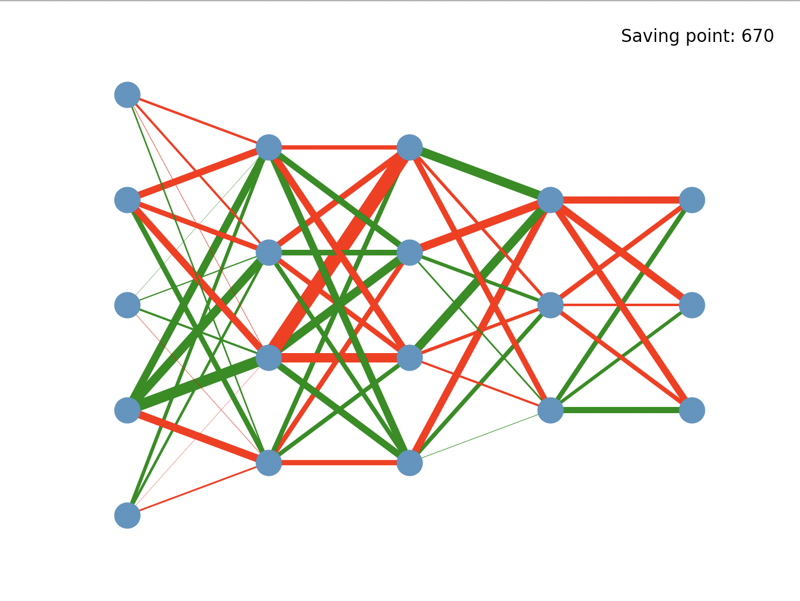

## 深度学习课程大作业——Reinforcement Car

### 简介

    
    

**Reinforcement Car**是一个基于强化学习的赛车游戏AI练习项目。我们使用Python独立实现了一款简单的赛车游戏，并基于DQN算法实现了这款游戏的一个简单的AI模型，玩家可以和AI模型进行比赛，同时我们还实现了模型状态的可视化功能。

### 介绍及问题描述

​	强化学习是深度学习的一个分支，在电子游戏方面也有着广泛的应用，已经在很多游戏中表现非常出色。我们想通过实现一个游戏场景并学习强化学习的相关知识。

​	赛车游戏本身具有一定的挑战性，对模型的泛化性有着很大的考验，因此我们实现了一款简单的赛车游戏，玩家控制赛车的左转右转，车辆在赛道中不断自动加速，在转向时会减速，碰到赛道或者障碍物则回到起点，先到达终点线的车辆胜利。同时，我们的游戏还支持通过鼠标自定义赛道形状，方便验证模型在不同环境下的表现。

​	DQN是强化学习中的一个经典方法，我们设计了一个简单的模型，包含4层FC和一层ReLU，并尝试使用经典的DQN方法训练，并验证模型效果。我们为其设置了一个简单的奖励机制，经测试该模型在训练后可以应对大部分赛道，并且与人类玩家表现相当。

​	为了更好的了解模型在游戏下的表现和DQN的流程，我们对模型的训练过程进行可视化，包含对模型权重的可视化和训练loss的可视化。

### 相关工作

我们分赛车游戏设计，模型设计和可视化三部分来介绍相关工作。

pygame是一个简单的游戏库SDL的Python版本，方便用户实现简单的2D游戏开发，我们的游戏使用pygame开发。在游戏设计方面，我们参考了一些强化学习小游戏的demo。从某款利用强化学习实现[FlappyBird](https://github.com/yenchenlin/DeepLearningFlappyBird)游戏中，我们得到启发，将模型的输出节点与游戏的输出一一对应；从某款强化学习[车辆控制](https://www.bilibili.com/video/BV1ox411x7S8?from=search&seid=11334047816925777247)的demo中，我们得到启发，使用车辆距前方的障碍距离作为输入。

模型训练方面，我们使用了经典DQN算法对模型进行训练。DQN解决了Q-learning在电子游戏下Q Table过大的问题。算法中有Target net和Eval net两个结构完全相同的网络。通过记忆库中随机取出的状态，奖励，动作以及target net对该状态的预测值对eval net进行训练，并定时用eval net的值更新target net。我们完全使用DQN算法来训练模型，只进行了超参数的调整。

可视化方面，我们希望观测在训练的过程中输入对于 AI 决策的影响。由于网络输入并不是图片，而是赛车到多个方位的障碍物的一系列距离，因此我们的网络只包含全连接层。我们采用经典的节点-链接图以可视化全连接层之间的权重，通过观察不同网络参数对应的赛车 AI 的行为，我们可以分析训练中存在的问题。此外，loss 函数的变化趋势也是神经网络训练中的常用调试工具。

### 实现方法

我们主要从游戏实现，模型训练，可视化3个方面介绍我们的实现方法。

- 游戏实现

  - 游戏框架搭建

    我们将游戏分成几个不同的状态，在一个状态下，我们将进入一个while循环，这个循环在一个固定的时间间隔内迭代。在每个周期中，框架将处理由pygame事件机制触发的事件，并呈现最新的ui内容。这构成了我们游戏的核心框架，整体框架如下。

    

        
    

  - 游戏逻辑设计

    我们的车辆会实时读取前方五个角度的障碍物距离，具体方式如下图：

    

        
    

    车辆在运行过程中会遍历场景中的每个障碍物和边线，使用几何关系进行碰撞检测。

    同时我们为训练过程提供了单帧运行游戏，返回所需的模型输入，接受模型输出控制小车等接口。

    

  - 自定义赛道

    我们将轨迹定义为两条多段线，自定义轨迹的过程是分别绘制多段线。用户可以用鼠标画线，左键是画下一点，右键是删除上一点。该框架将监听用户鼠标事件触发的事件，并记录鼠标在屏幕上的位置以呈现轨迹。屏幕上的插图文字也将帮助玩家知道如何绘制轨迹。

    

        

    

    

  - 画面渲染

    我们使用pygame库提供的接口来绘制UI，具体包括：

    - 使用`pygame.display`游戏包含整个游戏界面面板
    - 使用`pygame.draw.aaline`, `pygame.draw.rect`, `pygame.draw.aapolygon`画游戏中的赛道和车辆
    - 使用`pygame.Surface`类加载外部图像资源

    此外，我们还支持对AI控制的小车进行视角跟踪，使得渲染效果更好

    

- 模型训练

  - 模型设计

    考虑到我们的任务并不复杂，而且需要在训练过程中还能够渲染游戏界面查看效果。因此我们希望设计一个在满足任务需求的前提下尽可能轻量化的网络。我们的网络为4层FC网络，网络结构如下图所示，这个网络可以轻松的在CPU上进行训练和推理。

    

        
    

    

    根据任务需求，我们的网络有5个输入节点，对应5个方向障碍物距离。输出为3个节点，对应车辆的左转，直行，右转。我们使用输出值最大的节点对应的动作来控制车辆。

    

  - 训练算法

    我们使用PyTorch完成了模型的搭建和训练流程。

    - DQN算法细节

      我们每帧都对模型进行训练，因为在这一游戏中人类玩家的动作也是连续的。我们使用长度1000的记忆池保存车辆的状态。初始状态会先让模型自由运行50帧。我们使用ε-greedy方法在训练前期让模型产生更多的随机动作，防止快速收敛到局部最优，我们设置最初的随机概率为0.9，实验表明过低的初始随机概率会使得模型一直保持在一特定动作下难以训练。我们使用Adam优化器训练eval net，初始学习率为0.001，并且会随训练进度衰减。其他训练参数如下图所示：

      | 参数项       | 设定值                                      |
      | ------------ | ------------------------------------------- |
      | ε-greedy     | 初始随机概率0.9，γ=0.9，step=100，min=0.001 |
      | optimizer    | Adam LR=0.001，γ=0.1，step=50000            |
      | memory deque | size=1000，batch size=32                    |
      | others       | observe step=50，target model update=100    |

    - 奖励机制

      为了防止车辆撞到赛道边线和障碍物，我们将撞到的奖励设置为-1，为了使模型收敛更快，我们将两侧障碍物距离之比超过0.75的位置（即过于接近一侧障碍物）的奖励设置为-0.5。车辆冲线时奖励为1，其他状态下奖励均为0。我们会在之后的实验分析部分介绍奖励设置的理由。

- 可视化

  + 数据准备
  
    根据DQN算法的流程，在训练过程中，Target net是控制小车行为的网络。由于我们的网络模型规模很小，我们可以在每次Target net被更新的时候将当前的网络权重完全存下来，同时，我们也会计算并保存这一训练步上Target net的loss函数值。
  
  + 可视化渲染
  
    我们使用`NetworkX`中提供的`Graph`类来定义全连接网络所对应的节点-链接图的拓扑结构。对于全连接网络来说，层与层的结点之间的连接权重大小体现了数据流在网络传播过程中的重要程度的变化，而每层的偏置所包含的信息则较少。因此，我们只通过层与层的结点之间连边的颜色和粗细（红色代表正权、重，绿色代表负权重，边越粗则权重的绝对值越大）表示，而忽略每层结点的偏置。通过`matplotlib`提供的接口，我们可以依次显示每一个训练步对应的节点-链接图。此外，loss 变化趋势则使用折线图绘制。

### 实验结果

我们自定义一条赛道对模型进行训练，经过5000轮左右的训练，模型基本稳定通过赛道终点。我们在展示过程中呈现了从第一次训练到第一次冲过终点线的全过程。下图左侧是训练的赛道，右侧是某次测试的赛道，其中红色是人类玩家的车辆，右侧是AI的车辆，在训练过程人类玩家的车辆没有运动。

    
    

我们在多个自定义赛道（重新绘制了赛道和障碍物的位置）上对模型进行了测试，我们发现在人类玩家可以通过的赛道上AI模型全部可以通过，且通过时间少于不熟练的人类玩家。

但是在多次练习后，我们的人类玩家仍然可以战胜模型，这是因为我们的模型过分强调在赛道中间运行，而不会在弯道做出一些贴边线走近路的行为。说明我们的模型仍有提升的空间。

### 结果分析

【TODO】训练分析

+ 模型权重变化

  

      
      
  

  

      
      
  

  我们分别截取了网络在第80，100，200个训练步附近的网络权重示意图以及最终权重的示意图。

  网络在很早的训练步时（第60个训练步附近），就已经学到了前三个全连接层之间的大致权重，并且这一权重的分布基本保持到200个训练步之后，与最终的网络大致相同（只有极少一部分权重较小的边发生了符号的反转）；而变化较大的边集中在网络的后三层之间。我们注意到，在训练的过程中，在某一段时间内，后三个全连接层之间的权重有时会基本保持不变（如第60-100和140-200训练步之间），但是经过某一时刻后，网络的最后两层之间的权重会逐渐开始产生变化（如第10-140训练步之间），并且带动倒数第二层和倒数第三层之间的权重发生变化。结合训练过程中小车 AI 的操作视频我们可以分析知道，小车往往会在同一个地方失误多次，这时对应了后三层全中基本保持稳定的时间段，而当小车通过了之前一直无法通过的一个路段，权重发生变化，网络也学到了新的决策方式。

  

      
      
  

  同时我们也观察到，校车在极少数时候会出现原地打转的情况，我们同样也可视化此时的网络权重（上图左），和成功训练的网络权重相比（上图右），我们可以发现，原地打转的情况下，网络收敛时的权重都特别小，而且以前两层之间负权重边（绿色边）为主，这表明网络很可能陷入了一个错误的局部的最优值。同时，我们也看到，原地打转的时候，网络整体权重与一开始初始化的结果相差无几。因此，为了避免这种情况，可以考虑改善权重的初始化方式，或者在奖励函数中引入原地打转的惩罚来实现。

+ loss 变化

  由于我们会在训练中引入一定比例的随机操作，因此 loss 常会出现反常的“脉冲”型升高，但是总体而言，在第450个训练步以前 loss 呈现均值和方差下降的趋势。值得注意的一点是，loss 在第500个训练步之后稳定性有所减弱，这与赛道最后的一个小“拐弯”有关，由于网络在学习新的前进模式，因此 loss 会发生不稳定的情况。

  

      
  

### 分工

### 总结

